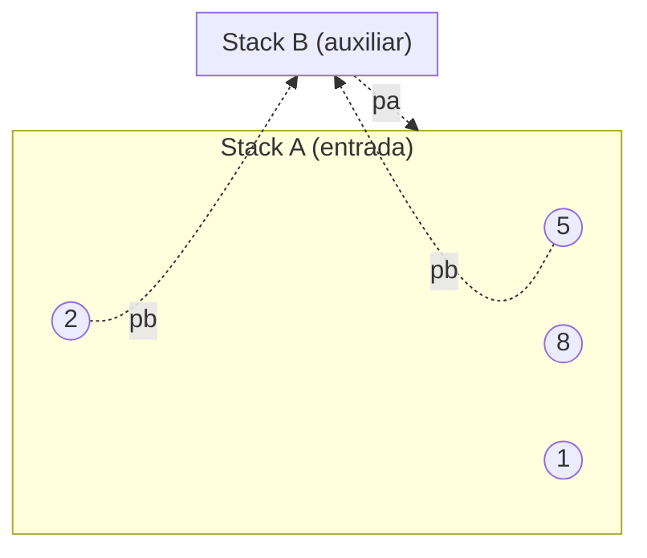

# 🌀 Push_swap - 42

**Push_swap** es un proyecto del cursus 42 cuyo objetivo es implementar un **algoritmo de ordenación eficiente** utilizando dos pilas (stacks) y un conjunto limitado de operaciones.  
El reto consiste en ordenar una lista de números con el **menor número de movimientos posible**.

---

## 🧠 Teoría general

### 📘 Algoritmos de ordenación
Un **algoritmo de ordenación** es un conjunto de instrucciones que organizan una lista de elementos en un orden determinado (por ejemplo, de menor a mayor).  
Los algoritmos clásicos como *Bubble Sort*, *Insertion Sort* o *Quick Sort* tienen diferentes **complejidades algorítmicas** según su eficiencia.

| Algoritmo | Complejidad media | Complejidad peor caso | Tipo |
|:-----------|:-----------------|:----------------------|:-----|
| Bubble Sort | O(n²) | O(n²) | Comparativo |
| Insertion Sort | O(n²) | O(n²) | Comparativo |
| Quick Sort | O(n log n) | O(n²) | Divide y vencerás |
| Merge Sort | O(n log n) | O(n log n) | Divide y vencerás |
| Radix Sort | O(n * k) | O(n * k) | No comparativo |

En **Push_swap**, no puedes usar estos algoritmos directamente, ya que estás limitado a una serie de **operaciones sobre dos pilas**.

---

### 🧩 Las pilas (stacks)

Push_swap utiliza dos pilas:  
- **Stack A:** contiene los números iniciales desordenados.  
- **Stack B:** pila auxiliar utilizada para reorganizar los valores.  

Ambas funcionan como **estructuras LIFO** (*Last In, First Out*):  
solo puedes **añadir o quitar elementos desde la parte superior**.

---

### ⚙️ Operaciones disponibles

Estas son las únicas operaciones permitidas para manipular las pilas:

| Operación | Descripción | Efecto |
|:-----------|:-------------|:--------|
| `sa` | Intercambia los dos primeros elementos de **A** | swap(a₁, a₂) |
| `sb` | Intercambia los dos primeros de **B** | swap(b₁, b₂) |
| `ss` | `sa` y `sb` a la vez | swap simultáneo |
| `pa` | Pasa el primer elemento de **B** a **A** | pop(B) → push(A) |
| `pb` | Pasa el primer elemento de **A** a **B** | pop(A) → push(B) |
| `ra` | Rota todos los elementos de **A** hacia arriba | top(A) pasa abajo |
| `rb` | Rota todos los elementos de **B** hacia arriba | top(B) pasa abajo |
| `rr` | `ra` y `rb` simultáneamente | rotación doble |
| `rra` | Rota **A** hacia abajo | bottom(A) pasa arriba |
| `rrb` | Rota **B** hacia abajo | bottom(B) pasa arriba |
| `rrr` | `rra` y `rrb` simultáneamente | rotación doble inversa |

---

## 🧮 Estrategia del algoritmo

### 🔹 Pequeños conjuntos (≤ 5 elementos)
Para pocos números, se utiliza una **estrategia directa**:
1. Detectar el valor mínimo o máximo.  
2. Moverlo a su posición correcta usando rotaciones (`ra`, `rra`).  
3. Repetir hasta que `A` quede ordenado.

### 🔸 Grandes conjuntos (> 5 elementos)
Para conjuntos grandes, Push_swap suele usar una combinación de:
- **Radix Sort** (ordenación binaria por bits).  
- **Cálculo de coste** (selecciona el movimiento más óptimo entre stacks).  
- **Posicionamiento inteligente** (usar `put_top`, `get_best_pair`, etc.).

El objetivo es **minimizar el número total de operaciones**.

---

## ⚙️ Instalación y compilación

### 🔧 Requisitos
- Linux o macOS  
- `make`, `gcc`  
- Biblioteca estándar (`unistd.h`, `stdlib.h`, `stdio.h`)

### 🏗️ Compilación

```bash
make
```

Esto genera el ejecutable:

```bash
./push_swap
```

Versión **bonus** (checker visualizador):

```bash
make bonus
```

### 🧹 Limpieza

```bash
make clean
make fclean
make re
```

---

## 💡 Uso y ejemplos

```bash
./push_swap 4 67 3 87 23
```

Salida esperada (serie de operaciones que ordenan la lista):

```
pb
pb
sa
pa
pa
```

Verificación con el **checker bonus**:

```bash
ARG="4 67 3 87 23"
./push_swap $ARG | ./checker $ARG
```

Resultado:

```
OK
```

---

## 🧱 Estructura del proyecto

```
push_swap/
├── Makefile
├── push_swap.c                → función principal
├── parsing.c, load_list.c     → validación y carga de los números
├── lists_aux.c, lists_utils.c → manejo de pilas enlazadas
├── operations/                → implementación de operaciones
│   ├── push.c, swap.c, rotate.c, reverse_rotate.c
├── algorithm/
│   ├── cost_algorithm.c, smaller_sort.c, put_top.c, get_best_pair.c
├── utils/
│   ├── ft_split.c, ft_atoi.c, ft_isdigit.c, error.c
└── bonus/
    ├── checker.c, checker_utils.c
    └── includes_bonus/push_swap_bonus.h
```

---

## 🔄 Diagrama 1 – Flujo general del programa

```mermaid
flowchart TD
    A([Inicio]) --> B[Leer y validar argumentos]
    B --> C[Guardar números en stack A]
    C --> D{¿Stack A está ordenado?}
    D -- Sí --> E[Finalizar programa]
    D -- No --> F[Calcular mejor movimiento]
    F --> G[Ejecutar operación (sa, pb, ra...)]
    G --> H[Actualizar stacks A y B]
    H --> D
    E --> I([Fin])
```

---

## 🔁 Diagrama 2 – Movimiento de elementos entre stacks



---

## 🧩 Bonus – Checker

El **checker** lee las operaciones generadas por `push_swap` y las aplica a las pilas para verificar si la lista final queda ordenada.

### Uso

```bash
ARG="4 67 3 87 23"
./push_swap $ARG | ./checker $ARG
```

Salida:
- `OK` → si la lista final está ordenada.  
- `KO` → si no está ordenada.  
- `Error` → si hay entradas inválidas o movimientos incorrectos.

---

## ⚙️ Complejidad y optimización

- Para **N ≤ 5** → algoritmo personalizado (`O(n²)` aprox).  
- Para **N > 5** → enfoque tipo *Radix Sort* (`O(n log n)` aprox).  
- Cada operación cuesta `O(1)` (rotar, swap, push).  
- El rendimiento final depende del número total de operaciones totales emitidas.

---

## 🧱 Normas 42

- Cumple **Norminette**.  
- Sin **memory leaks** (`valgrind` recomendado).  
- Sin funciones no autorizadas.  
- Gestión rigurosa de errores.  
- Uso correcto de estructuras enlazadas y asignaciones dinámicas.

---

## 👨‍💻 Autor

**Aurodrig**  
42 Campus  
[https://github.com/aurodrig](https://github.com/aurodrig)
